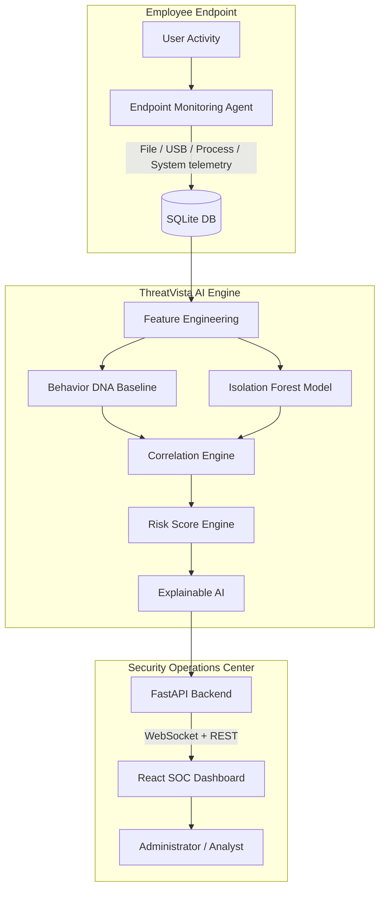
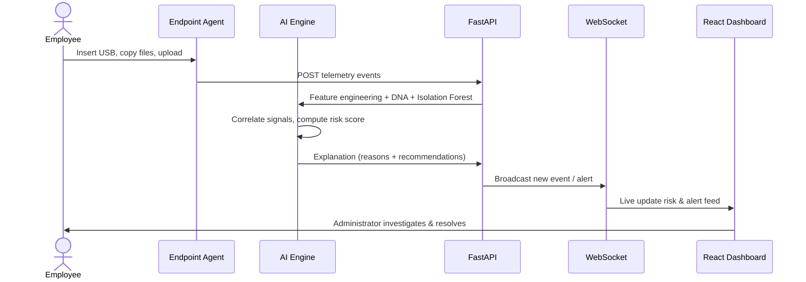

# ThreatVista

**AI-Powered, Privacy-First Insider Threat Detection System**

ThreatVista monitors **metadata** of employee activity — file operations, USB connections, login patterns, and network uploads — to detect insider threats without ever reading file contents. An **Isolation Forest** machine-learning model learns each employee's unique **Behavior DNA**, flags anomalies, correlates suspicious event chains, and drives a real-time SOC dashboard.

---

## 🚨 Problem Statement

Traditional Data Loss Prevention (DLP) systems inspect file contents, raising privacy concerns and being easily bypassed. Organizations struggle to detect **insider threats** — the trusted employee who copies data to USB, uploads to personal cloud, or covers their tracks — until it's too late.

**ThreatVista's answer:** monitor *what* employees do (metadata), not *what* they read. By profiling each employee's normal behavior and scoring deviations, it catches exfiltration patterns with **zero content inspection**.

---

## ✨ Key Features

- **Privacy-First Metadata Monitoring** — tracks file, USB, network, and process activity; never scans document contents.
- **Behavior DNA Profiling** — learns per-employee baselines: working hours, USB usage, file copy rates, upload volumes.
- **Isolation Forest Anomaly Detection** — unsupervised ML flags behavioral outliers from the normal baseline.
- **Event Correlation Engine** — chains related signals (USB + mass copy = exfiltration; deletions + USB removal = cover-up).
- **Explainable AI (XAI)** — every risk score comes with plain-English *reasons* and *recommendations*.
- **Real-Time SOC Dashboard** — live WebSocket event feed, risk trends, behavior DNA cards, alert ledger.
- **Secure Authentication** — bcrypt password hashing, signed JWTs, role-based access (Administrator / Security Analyst).
- **Persisted Threat Engine Settings** — risk thresholds are configurable and actually drive classification.

---

## 🏗 System Architecture



## 🔄 Detection Workflow



---

## 🛠 Technology Stack

| Layer | Technology |
|-------|-----------|
| Frontend | React 19, Vite 8, Tailwind CSS, Recharts, lucide-react |
| Backend | FastAPI, Uvicorn, SQLAlchemy |
| AI / ML | scikit-learn (Isolation Forest), pandas, numpy, joblib |
| Database | SQLite |
| Endpoint Agent | Watchdog, psutil, pywin32 / WMI |
| Auth | bcrypt, python-jose (JWT) |
| Realtime | FastAPI WebSockets |

---

## 📦 Installation Guide

### Prerequisites
- **Python 3.10+**
- **Node.js 18+**
- **Windows** (endpoint agent uses WMI)

### 1. Clone & install Python dependencies
```bash
pip install -r requirements.txt
```

### 2. Initialize & seed the database
```bash
python backend/database/db_setup.py
```
This creates all tables and seeds 3 employees, behavior DNA profiles, risk history, and demo users.

### 3. Train the AI model (optional — a trained model ships in `models/`)
```bash
python ai/train.py
```

### 4. Start the backend
```bash
python -m uvicorn backend.main:app --host 127.0.0.1 --port 8000
```
Backend runs at `http://127.0.0.1:8000` (docs at `/docs`).

### 5. Start the frontend
```bash
cd frontend
npm install
npm run dev
```
Dashboard runs at `http://localhost:5173`.

### 6. (Optional) Run the endpoint agent on a Windows machine
```bash
python endpoint_agent/agent.py
```

---

## 🔐 Demo Accounts

| Role | Username | Password |
|------|----------|----------|
| SOC Administrator | `admin` | `admin123` |
| Security Analyst | `analyst` | `analyst123` |

---

## 🎬 Hackathon Demo

Replay the four judge-facing scenarios against a running backend:

```bash
python scripts/demo_scenarios.py
```

| Scenario | Action | Expected Risk |
|----------|--------|---------------|
| 1. Normal Employee | Login 9 AM, edit documents | ✅ **Safe** |
| 2. USB Activity | Insert USB, copy 5 files | ⚠️ **Medium** |
| 3. Insider Threat | Midnight login → USB → 700-file copy → upload | 🚨 **Critical** |
| 4. Cover-Up Attempt | Delete files, remove USB, wipe temp | 🔴 **High → Critical** |

Each scenario injects real telemetry through the API, streams into the dashboard live, and runs the AI pipeline to surface reasons and recommendations.

---

## 🔌 API Reference

All data endpoints require `Authorization: Bearer <token>` (except `POST /auth/login` and telemetry ingestion `POST /events`).

| Method | Endpoint | Description |
|--------|----------|-------------|
| POST | `/api/auth/login` | Authenticate, returns JWT |
| POST | `/api/auth/logout` | Invalidate session |
| GET | `/api/auth/me` | Current user + role |
| GET | `/api/status` | Backend health check |
| GET | `/api/dashboard` | Risk stats & distributions |
| GET | `/api/employees` | Employee list |
| GET | `/api/employees/{id}` | Employee detail + live AI analysis |
| POST | `/api/events` | Ingest telemetry (agent / demo) |
| GET | `/api/events` | Query events |
| GET | `/api/alerts` | Alert ledger |
| POST | `/api/ai/analyze/{id}` | Run AI, persist risk score |
| GET | `/api/ai/analysis/{id}` | Run AI, no persistence |
| GET/PUT | `/api/settings` | Read / update threat engine config |

---

## 🤖 AI Workflow

1. **Preprocessing** — normalize raw telemetry events.
2. **Feature Engineering** — aggregate into 16 windowed features (24h/1h): file counts, USB inserts, upload MB, login hour, night/weekend activity, CPU/RAM, process activity.
3. **Behavior DNA** — compute per-employee baseline (working hours, average USB/copies/uploads).
4. **Anomaly Detection** — Isolation Forest scores each employee against their history; outliers are flagged.
5. **Correlation** — chain signals: USB mass exfiltration, night upload spike, evidence destruction, process+file automation.
6. **Risk Scoring** — weighted 0–100 score with configurable thresholds (Safe / Medium / High / Critical).
7. **Explainable AI** — produce human-readable reasons + mitigation recommendations.

---

## 👥 User Manual

- **Dashboard** — stat cards, live event feed, ranked employee table, high-risk alerts.
- **Employees** — search/filter directory; click any employee for Behavior DNA, risk timeline, AI recommendations, raw telemetry.
- **Alerts** — ledger with severity/status filters; escalate to Investigation.
- **Analytics** — AI/hardware/network panels, risk & severity distributions.
- **Settings** — adjust risk classification thresholds and telemetry toggles; changes persist and immediately affect the AI engine.

---

## 🧭 Future Scope

- **Live endpoint agent queueing** — local SQLite buffering with offline sync to the backend.
- **ML model retraining loop** — periodic retrain on new behavior as risk profiles evolve.
- **Multi-endpoint aggregation** — dashboard-wide view across all company endpoints.
- **Alert status lifecycle** — persist Investigate / Resolve transitions through the API.
- **Real DLP integrations** — policy enforcement hooks (USB block, bandwidth throttle).
- **Email / Slack notifications** on Critical alerts.

---

## 📁 Project Structure

```
ThreatVista/
├── ai/                   # Behavior DNA, Isolation Forest, correlation, risk, XAI
├── backend/              # FastAPI app, auth, routes, services, models
├── endpoint_agent/       # Windows endpoint monitoring client
├── frontend/             # React + Vite + Tailwind SOC dashboard
├── database/             # SQLite database
├── models/               # Trained Isolation Forest model (.joblib)
├── docs/                 # Architecture & workflow documentation
├── scripts/              # Demo scenario replay
└── requirements.txt
```
