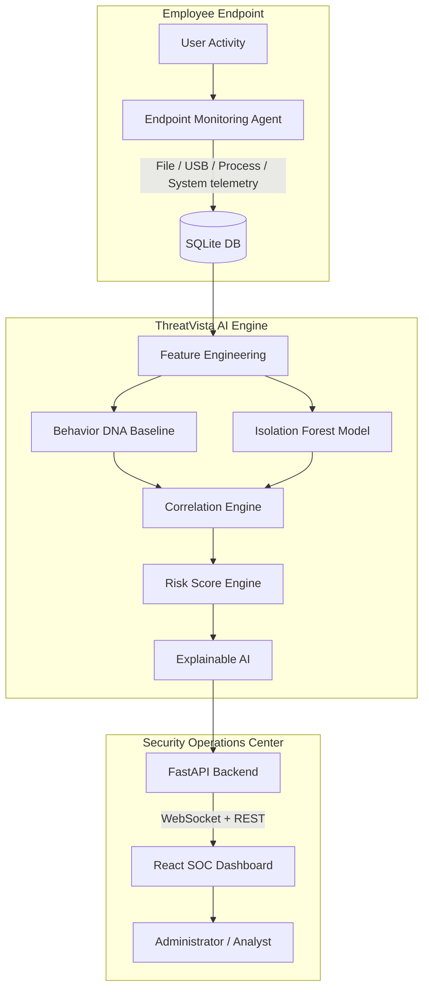
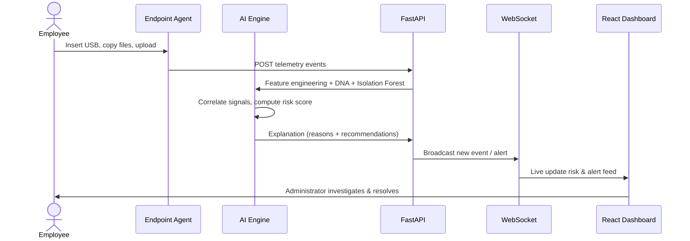

# ThreatVista

**AI-Powered, Privacy-First Insider Threat Detection System**

ThreatVista monitors **metadata** of employee activity — file operations, USB connections, login patterns, and network uploads — to detect insider threats without ever reading file contents. An **Isolation Forest** machine-learning model learns each employee's unique **Behavior DNA**, flags anomalies, correlates suspicious event chains, and drives a real-time SOC dashboard.

---

## 🚨 Problem Statement

Traditional Data Loss Prevention (DLP) systems inspect file contents, raising privacy concerns and being easily bypassed. Organizations struggle to detect **insider threats** — the trusted employee who copies data to USB, uploads to personal cloud, or covers their tracks — until it's too late.

**ThreatVista's answer:** monitor *what* employees do (metadata), not *what* they read. By profiling each employee's normal behavior and scoring deviations, it catches exfiltration patterns with **zero content inspection**.

---

## ✨ Key Features

- **Privacy-First Metadata Monitoring** — tracks file, USB, network, and process activity; never scans document contents.
- **Behavior DNA Profiling** — learns per-employee baselines: working hours, USB usage, file copy rates, upload volumes.
- **Isolation Forest Anomaly Detection** — unsupervised ML flags behavioral outliers from the normal baseline.
- **Event Correlation Engine** — chains related signals (USB + mass copy = exfiltration; deletions + USB removal = cover-up).
- **Explainable AI (XAI)** — every risk score comes with plain-English *reasons* and *recommendations*.
- **Real-Time SOC Dashboard** — live WebSocket event feed, risk trends, behavior DNA cards, alert ledger.
- **Secure Authentication** — bcrypt password hashing, signed JWTs with server-side session revocation (real logout), login throttling, and three roles: Administrator / Security Analyst / Read-Only Auditor.
- **Audit Trail** — every sensitive action (login, alert transitions, settings changes, report downloads) is logged for review.
- **Downloadable Reports** — daily / weekly / monthly / high-risk / USB / file / network reports as CSV, JSON, or printable HTML.
- **Persisted Threat Engine Settings** — risk thresholds are configurable and actually drive classification.
- **Enterprise EDR Architecture** — endpoint agents auto-register their device identity (hostname, OS, CPU, RAM, IP), send live **heartbeats**, and stream telemetry; the dashboard shows **online/offline status**, endpoint device profiles, endpoint health, and per-employee **behavior timelines**.
- **AI Confidence Score** — every risk assessment includes a 0–100 confidence metric alongside the top reasons.
- **Remote Endpoint Commands** — the SOC console can dispatch actions (disable USB, restart agent, collect logs, refresh config) — simulated for the hackathon.

---

## 🏗 System Architecture



## 🔄 Detection Workflow



---

## 🛠 Technology Stack

| Layer | Technology |
|-------|-----------|
| Frontend | React 19, Vite 8, Tailwind CSS, Recharts, lucide-react |
| Backend | FastAPI, Uvicorn, SQLAlchemy |
| AI / ML | scikit-learn (Isolation Forest), pandas, numpy, joblib |
| Database | SQLite |
| Endpoint Agent | Watchdog, psutil, pywin32 / WMI |
| Auth | bcrypt, python-jose (JWT) |
| Realtime | FastAPI WebSockets |

---

## 📦 Installation Guide

### Prerequisites
- **Python 3.10+**
- **Node.js 18+**
- **Windows** (endpoint agent uses WMI)

### 1. Clone & install Python dependencies
```bash
pip install -r requirements.txt
```

### 2. Initialize & seed the database
```bash
python backend/database/db_setup.py
```
This creates all tables and seeds 3 employees, behavior DNA profiles, risk history, and demo users.

### 3. Train the AI model (optional — a trained model ships in `models/`)
```bash
python ai/train.py
```

### 4. Start the backend
```bash
python -m uvicorn backend.main:app --host 0.0.0.0 --port 8000
```
Backend runs at `http://127.0.0.1:8000` (docs at `/docs`). Binding `0.0.0.0`
exposes it on every interface so endpoint agents on other machines can reach
it. The bind host/port can also be set with `THREATVISTA_HOST` /
`THREATVISTA_PORT` (see `.env.example`).

### 5. Start the frontend
```bash
cd frontend
npm install
npm run dev
```
Dashboard runs at `http://localhost:5173` (also on the LAN at
`http://<your-ip>:5173` when Vite's `server.host` is enabled, which it is by
default in `vite.config.js`).

### 6. (Optional) Run the endpoint agent on a Windows machine
```bash
python endpoint_agent/agent.py
```

### 7. LAN demo — one SOC server, many endpoints (hackathon)
Turn your laptop into the Security Operations Center and teammates' laptops
into monitored endpoints, all on the same Wi-Fi:

1. **On the server laptop**, find its LAN IPv4: `ipconfig` (e.g. `192.168.1.100`).
2. **Allow the API through Windows Firewall** (run as admin once):
   ```powershell
   netsh advfirewall firewall add rule name="ThreatVista API" dir=in action=allow protocol=TCP localport=8000
   netsh advfirewall firewall add rule name="ThreatVista Dashboard" dir=in action=allow protocol=TCP localport=5173
   ```
3. **On every endpoint machine**, point the agent at the server before starting it:
   ```bash
   set BACKEND_URL=http://192.168.1.100:8000
   python endpoint_agent/agent.py
   ```
   Each machine must use a different `AGENT_EMPLOYEE_EMAIL` (a seeded employee).
4. **On the server**, point the frontend at the backend:
   ```bash
   cd frontend
   echo VITE_API_BASE_URL=http://192.168.1.100:8000/api > .env
   npm run dev
   ```
   Teammates open `http://192.168.1.100:5173` to watch live telemetry, then
   create files, insert USB drives, and copy folders to a USB stick to trigger
   events, correlation alerts, and the **Active Sessions** page.

---

## 🔐 Demo Accounts

| Role | Username | Password | Scope |
|------|----------|----------|-------|
| SOC Administrator | `admin` | `admin123` | Full access incl. audit trail & session management |
| Security Analyst | `analyst` | `analyst123` | Full monitoring, alert mitigation, settings |
| Read-Only Auditor | `auditor` | `auditor123` | View everything, no writes (read-only) |

---

## 🎬 Hackathon Demo

Replay the four judge-facing scenarios against a running backend:

```bash
python scripts/demo_scenarios.py
```

| Scenario | Action | Expected Risk |
|----------|--------|---------------|
| 1. Normal Employee | Login 9 AM, edit documents | ✅ **Safe** |
| 2. USB Activity | Insert USB, copy 5 files | ⚠️ **Medium** |
| 3. Insider Threat | Midnight login → USB → 700-file copy → upload | 🚨 **Critical** |
| 4. Cover-Up Attempt | Delete files, remove USB, wipe temp | 🔴 **High → Critical** |

Each scenario injects real telemetry through the API, streams into the dashboard live, and runs the AI pipeline to surface reasons and recommendations.

---

## 🔌 API Reference

All data endpoints require `Authorization: Bearer <token>` (except `POST /auth/login` and telemetry ingestion `POST /events`).

| Method | Endpoint | Description | Access |
|--------|----------|-------------|--------|
| POST | `/api/auth/login` | Authenticate, returns JWT (throttled: 5 fails → 15-min lockout) | public |
| POST | `/api/auth/logout` | Revoke current session server-side | any authenticated |
| GET | `/api/auth/me` | Current user + role | any authenticated |
| GET | `/api/auth/sessions` | List sessions (admins may filter by `user_id`) | self / admin |
| DELETE | `/api/auth/sessions/{id}` | Revoke a session (admin/analyst for others, self always) | self / admin |
| GET | `/api/status` | Backend health check | public |
| GET | `/api/dashboard` | Risk stats & distributions | any authenticated |
| GET | `/api/employees` | Employee list | any authenticated |
| GET | `/api/employees/{id}` | Employee detail + live AI analysis | any authenticated |
| POST | `/api/events` | Ingest telemetry (agent / demo; `X-Agent-Key` when configured) | agent |
| GET | `/api/events` | Query events | any authenticated |
| GET | `/api/alerts` | Alert ledger | any authenticated |
| PATCH | `/api/alerts/{id}` | Transition alert status (Active → Investigating → Resolved) | admin/analyst |
| GET | `/api/audit-logs` | Security audit trail (login, settings, alerts, reports…) | admin |
| POST | `/api/ai/analyze/{id}` | Run AI, persist risk score | admin/analyst |
| GET | `/api/ai/analysis/{id}` | Run AI, no persistence | any authenticated |
| GET/PUT | `/api/settings` | Read / update threat engine config | read: all / write: admin,analyst |
| GET | `/api/reports/{type}` | Download report (`format=csv\|json\|html`, `start`, `end`) | any authenticated |
| POST | `/api/agent/register` | Register endpoint device for an employee (`employee_email` + device profile) | agent |
| POST | `/api/agent/heartbeat` | Heartbeat to keep a device online + refresh health | agent |
| POST | `/api/employees/{id}/commands` | Dispatch a (simulated) remote command | admin/analyst |
| GET | `/api/employees/{id}/commands` | List command history for an endpoint | any authenticated |

**Reports**: `daily_threat`, `weekly_activity`, `monthly_summary`, `high_risk_employees`, `usb_usage`, `file_activity`, `network_activity`.

**Environment variables** (see `.env.example`): `THREATVISTA_SECRET_KEY` (JWT secret), `THREATVISTA_CORS_ORIGINS`, `THREATVISTA_AGENT_KEY` (optional shared key that protects `POST /events`).

---

## 🤖 AI Workflow

1. **Preprocessing** — normalize raw telemetry events.
2. **Feature Engineering** — aggregate into 16 windowed features (24h/1h): file counts, USB inserts, upload MB, login hour, night/weekend activity, CPU/RAM, process activity.
3. **Behavior DNA** — compute per-employee baseline (working hours, average USB/copies/uploads).
4. **Anomaly Detection** — Isolation Forest scores each employee against their history; outliers are flagged.
5. **Correlation** — chain signals: USB mass exfiltration, night upload spike, evidence destruction, process+file automation.
6. **Risk Scoring** — weighted 0–100 score with configurable thresholds (Safe / Medium / High / Critical).
7. **Explainable AI** — produce human-readable reasons + mitigation recommendations.

---

## 👥 User Manual

- **Dashboard** — stat cards (incl. **Online Endpoints**), live event feed, ranked employee table with online indicators, high-risk alerts.
- **Employees** — search/filter directory with online/offline dots; click any employee for Behavior DNA, risk timeline, AI confidence, raw telemetry, **endpoint device profile**, endpoint health, **behavior timeline**, activity explorer (USB / processes / files), and **remote command** dispatch.
- **Alerts** — ledger with severity/status filters; escalate to Investigation.
- **Analytics** — AI/hardware/network panels, risk & severity distributions.
- **Settings** — adjust risk classification thresholds and telemetry toggles; changes persist and immediately affect the AI engine.

---

## 🧭 Future Scope

- **Live endpoint agent queueing** — local SQLite buffering with offline sync to the backend.
- **ML model retraining loop** — periodic retrain on new behavior as risk profiles evolve.
- **Multi-endpoint aggregation** — dashboard-wide view across all company endpoints.
- **Alert status lifecycle** — persist Investigate / Resolve transitions through the API.
- **Real DLP integrations** — policy enforcement hooks (USB block, bandwidth throttle).
- **Email / Slack notifications** on Critical alerts.

---

## 📁 Project Structure

```
ThreatVista/
├── ai/                   # Behavior DNA, Isolation Forest, correlation, risk, XAI
├── backend/              # FastAPI app, auth, routes, services, models
├── endpoint_agent/       # Windows endpoint monitoring client
├── frontend/             # React + Vite + Tailwind SOC dashboard
├── database/             # SQLite database
├── models/               # Trained Isolation Forest model (.joblib)
├── docs/                 # Architecture & workflow documentation
├── scripts/              # Demo scenario replay
└── requirements.txt
```
