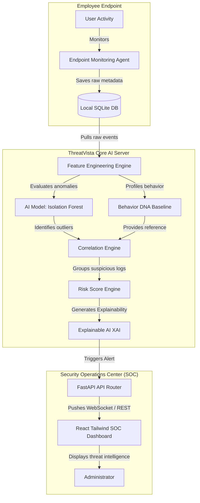

# ThreatVista - System Architecture

ThreatVista is built using a decoupled, modular design that enables secure, local-first endpoint telemetry monitoring and offline-first threat analysis.

## System Components

### 1. Endpoint Monitoring Agent
* **Purpose**: Runs transparently in the background of the employee's computer. It intercepts operating system events without inspecting personal content.
* **Libraries**: 
  * `Watchdog`: Monitors directory creation, file moves, renames, and deletions.
  * `psutil` & `pywin32`: Checks process creation and system resource indicators.
  * `WMI`: Listens for plug-and-play USB inserts.
* **Storage**: Events are stored in a local SQLite file (`threatvista.db`) to withstand network disconnections.

### 2. Feature Engineering & Behavior DNA
* **Feature Engineering**: Aggregates event streams into windowed features (e.g., file counts in the last hour, upload sizes, login hours deviation).
* **Behavior DNA**: Establishes a normal behavioral footprint (working hours, upload bounds, USB usage) specific to each employee.

### 3. AI & Threat Analysis Engines
* **Isolation Forest**: An unsupervised machine learning algorithm from `scikit-learn` that isolates anomalies (unusually high actions, weird login hours) without requiring pre-labeled threat datasets.
* **Correlation Engine**: Groups multiple minor alerts (e.g., a USB insertion + mass file copy) into single high-priority threats.
* **Explainable AI (XAI)**: Generates human-readable descriptions of why the user's score was raised, outlining actionable mitigation recommendations.

### 4. Admin Dashboard UI
* **Frontend**: React application built with Tailwind CSS, utilizing Recharts for Behavior DNA visualizations and Lucide Icons for responsive styling.
* **Backend**: FastAPI web server serving JSON APIs for employee state, event feeds, analytics, and active security logs.
