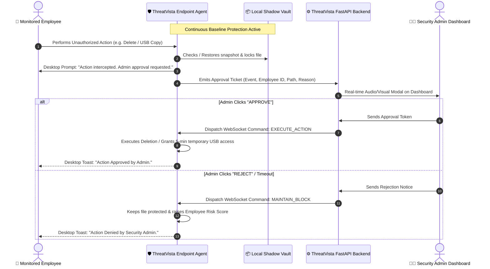

# ThreatVista Role-Based Risk Matrix & JIT Admin Authorization Blueprint

This document provides a comprehensive security specification for **ThreatVista**:
1. **The Recommended Admin Permission & Action Interception Architecture** (Pre-Action JIT Authorization).
2. **The Complete Role-Based Threat & Risk Intelligence Matrix** covering all 9 employee roles, their expected baselines, suspicious extensions, risk modifiers, and exact triggering actions.

---

## 1. Recommended Method for Admin Permission on Critical Actions

### Verdict: Method 1 (Hybrid Shadow-Vault with Instant Rollback & Live Admin Approval Ticket)
For ThreatVista’s Python endpoint agent and web dashboard architecture, **Method 1** is the most reliable, cross-compatible, and enterprise-grade approach because:
- **Zero Kernel Dependencies**: Does not require unsigned Windows kernel drivers (`.sys`), eliminating BSOD crash risks and complex driver signing certificates.
- **Instant Data Loss Prevention (Zero-Data-Loss)**: If an employee deletes a file without permission, it is instantly restored from the local encrypted shadow vault before any data is permanently lost.
- **Real-Time JIT Authorization**: Ties directly into ThreatVista’s existing WebSocket architecture and React Admin Dashboard.



---

## 2. Universal Threat Scoring Architecture

Threat scores in ThreatVista range from **0% to 100%** across 4 classification bands:

```
[  0% - 49% : SAFE / NORMAL  ]   --> Standard day-to-day operations
[ 50% - 74% : SUSPICIOUS     ]   --> Moderate anomaly / Policy warning logged
[ 75% - 89% : HIGH RISK      ]   --> Automated incident created; Admin notified
[ 90% - 100%: CRITICAL       ]   --> Immediate exfiltration / Evidence destruction alert
```

### Universal Core Penalties (Applied across all roles)
* **Removable USB Inserted**: `+10 Risk`
* **USB Data Staging Pattern** (USB + file operations to media): `+15 Risk` (+ `+10` correlation)
* **USB Mass Exfiltration** (USB + >50 files in 24h): `+25 Risk`
* **Evidence Destruction Pattern** (Mass deletions following USB removal / cleanup): `+30 Risk`
* **Sensitive Company Keywords in Compressed Archive (`.zip`, `.tar.gz`)**: `+40 to +70 Risk`
* **Off-Hours / Night Activity** (Outside 09:00 - 17:00 / 22:00 - 06:00): `+15 Risk`
* **Weekend Activity**: `+10 Risk`
* **Large Network Upload Spike** (>500MB): `+20 Risk` (or `+10` for >100MB)
* **AI Behavior DNA Anomaly**: `+15 Risk`

---

## 3. Comprehensive Role-by-Role Threat Matrix

---

### 1. Developer (Software Engineering & Development)
* **Profile Summary**: High volume of source code file creation, compilation artifacts, dependency installations, and Git operations.

#### Allowed / Normal Baseline:
* **Extensions**: `.py`, `.js`, `.ts`, `.jsx`, `.tsx`, `.cpp`, `.c`, `.h`, `.hpp`, `.java`, `.go`, `.rs`, `.cs`, `.php`, `.rb`, `.html`, `.css`, `.scss`, `.json`, `.yaml`, `.yml`, `.xml`, `.sql`, `.md`, `.sh`, `.bash`, `.bat`, `.ps1`, `.env`, `.gitignore`, `.lock`.
* **Daily 24h Thresholds**: Up to **300 copies**, **300 creates**, **500 modifies**.
* **High Process Activity**: Normal during build/compile workflows.

#### Suspicious / Forbidden Extensions:
* `.kdbx` (Password databases), `.key`, `.pem` (Private crypto keys), `.dwg` (CAD schematics).

#### What Triggers Risk & Why:
| Action / Event | Risk Added | Explanation |
| :--- | :--- | :--- |
| **Mass File Operations (>100 files)** | `+10` (Low penalty) | Adjusted for compile builds (`node_modules`, `target`, `bin`). |
| **Source Code Copy / Archive** | `+15` (Low penalty) | Source code movement is standard during repo operations. |
| **Staging Code to USB Removable Media** | `+25 to +40` | **Violation**: Transferring proprietary source code to personal USB. |
| **Zipping Code with Keywords (`secret`, `salary`)** | `+50 to +70` | **Severe**: Staging IP / confidential files into archives. |
| **Evidence Destruction (Deleting >4 files post-USB)** | `+30` | **Severe**: Deleting traces or cleanup scripts after copying. |

---

### 2. HR (Human Resources)
* **Profile Summary**: Handling personnel records, employee onboarding, resumes, and payroll documentation. Strictly restricted from touching code or executable scripts.

#### Allowed / Normal Baseline:
* **Extensions**: `.pdf`, `.docx`, `.doc`, `.xlsx`, `.xls`, `.csv`, `.txt`, `.rtf`, `.pptx`, `.ppt`, `.png`, `.jpg`, `.jpeg`.
* **Daily 24h Thresholds**: Max **30 copies**, **25 creates**, **50 modifies**.

#### Suspicious / Forbidden Extensions:
* `.py`, `.js`, `.ts`, `.cpp`, `.c`, `.java`, `.go`, `.rs`, `.sql`, `.sh`, `.bash`, `.exe`, `.dll`, `.ps1`, `.kdbx`, `.pem`, `.key`.

#### What Triggers Risk & Why:
| Action / Event | Risk Added | Explanation |
| :--- | :--- | :--- |
| **Opening / Copying Source Code (`.py`, `.js`, etc.)** | `+40` (Immediate) | **Abnormal**: HR staff has zero business need to manipulate code. |
| **Mass File Operations (>100 files in 24h)** | `+40` | **Abnormal**: Bulk file replication suggests data harvesting. |
| **Compressing Archives (`.zip`, `.tar.gz`)** | `+35` | **Suspicious**: Compressing candidate PII or personnel files. |
| **Process / Command-Line Bursts (`cmd.exe`, `powershell`)** | `+25` | **High Anomaly**: HR workstations should not execute CLI scripts. |
| **Exfiltrating Employee PII (`salary`, `payroll.xlsx`)** | `+40 to +60` | **Severe**: PII data leak / regulatory violation. |

---

### 3. Finance (Accounting, Payroll & Treasury)
* **Profile Summary**: Financial ledgers, spreadsheet analysis, tax filings, and vendor invoices. Highest risk for financial fraud and source code exfiltration.

#### Allowed / Normal Baseline:
* **Extensions**: `.xlsx`, `.xls`, `.csv`, `.pdf`, `.docx`, `.doc`, `.tsv`, `.txt`.
* **Daily 24h Thresholds**: Max **40 copies**, **35 creates**, **60 modifies**.

#### Suspicious / Forbidden Extensions:
* `.zip`, `.tar`, `.gz`, `.7z`, `.rar`, `.py`, `.js`, `.sql`, `.sh`, `.exe`, `.kdbx`, `.key`, `.pem`.

#### What Triggers Risk & Why:
| Action / Event | Risk Added | Explanation |
| :--- | :--- | :--- |
| **Handling Source Code Files** | `+50` (Severe) | **Major Flag**: Finance users accessing database/repo code. |
| **Creating or Copying Compressed Archives (`.zip`)** | `+50` (Severe) | **Major Flag**: Compression is the primary step in financial data exfiltration. |
| **Mass File Duplication (>100 files)** | `+40` | **Abnormal**: Bulk extraction of accounting reports. |
| **Financial Keyword Matching (`budget`, `salary`, `wire`)** | `+30 to +60` | Sensitive asset detection engine flags asset movement. |
| **USB Transfer of Ledger Spreadsheets** | `+35 to +50` | Direct attempt to export company fiscal data to unmanaged media. |

---

### 4. Sales (Business Development & Client Relations)
* **Profile Summary**: Customer outreach, pitch decks, proposals, and client account management.

#### Allowed / Normal Baseline:
* **Extensions**: `.pptx`, `.ppt`, `.pdf`, `.docx`, `.doc`, `.xlsx`, `.xls`, `.csv`, `.png`, `.jpg`.
* **Daily 24h Thresholds**: Max **50 copies**, **40 creates**, **70 modifies**.

#### Suspicious / Forbidden Extensions:
* `.py`, `.js`, `.sql`, `.sh`, `.exe`, `.zip`, `.tar`, `.kdbx`, `.pem`.

#### What Triggers Risk & Why:
| Action / Event | Risk Added | Explanation |
| :--- | :--- | :--- |
| **Accessing Source Code or Database Files** | `+45` | **Abnormal**: Sales representatives should not access backend code. |
| **Mass File Copying (>100 files)** | `+35` | **Risk**: Downloading client CRM databases prior to resignation. |
| **Creating ZIP Archives of Documents** | `+35` | Bundling customer lists and proposals for export. |
| **Exfiltrating Keywords (`client`, `customer`, `contract`)** | `+20 to +40` | Proprietary client database theft. |
| **Off-Hours Large Uploads** | `+30` | Uploading lead lists to personal cloud storage overnight. |

---

### 5. Security Analyst (SOC, Incident Response & Defense)
* **Profile Summary**: Running diagnostics, inspecting network packets, analyzing logs, and executing threat hunting scripts.

#### Allowed / Normal Baseline:
* **Extensions**: `.log`, `.txt`, `.json`, `.csv`, `.pcap`, `.pdf`, `.docx`, `.sh`, `.ps1`, `.py`, `.yara`, `.yaml`, `.yml`.
* **Daily 24h Thresholds**: Up to **120 copies**, **100 creates**, **150 modifies**.
* **High Process Activity**: Normal (`0 penalty` for process execution bursts).

#### Suspicious / Forbidden Extensions:
* `.kdbx` (Password database vault).

#### What Triggers Risk & Why:
| Action / Event | Risk Added | Explanation |
| :--- | :--- | :--- |
| **Unapproved USB Mass Export (>50 files)** | `+25` | Copying network PCAPs or forensic images to personal USB. |
| **Exfiltrating Password Vaults (`.kdbx`)** | `+40` | Unauthorized access to enterprise credential databases. |
| **Anti-Forensic Log Deletion** | `+30` | Deleting security logs or event traces without a change ticket. |

---

### 6. IT Support (System Administration & Helpdesk)
* **Profile Summary**: Software rollouts, OS maintenance, driver installations, and remote diagnostics.

#### Allowed / Normal Baseline:
* **Extensions**: `.msi`, `.exe`, `.bat`, `.ps1`, `.sh`, `.inf`, `.log`, `.txt`, `.cfg`, `.ini`, `.zip`.
* **Daily 24h Thresholds**: Up to **150 copies**, **120 creates**, **200 modifies**.
* **Process Bursts**: Tolerated (`+5` minimal penalty).

#### Suspicious / Forbidden Extensions:
* `.kdbx` (Password databases), `.key` (Master root private keys).

#### What Triggers Risk & Why:
| Action / Event | Risk Added | Explanation |
| :--- | :--- | :--- |
| **Exporting Corporate Private Keys (`.pem`, `.key`)** | `+40` | Harvesting infrastructure SSL/SSH keys. |
| **Accessing Unapproved Sensitive Archives** | `+35` | Extracting HR/Finance archives under the guise of maintenance. |
| **Off-Hours Remote Data Upload Spikes** | `+30` | Exfiltrating system configs to external unauthorized IPs. |

---

### 7. Administrator (Enterprise SysAdmins & DevOps)
* **Profile Summary**: Full system administrative permissions, database maintenance, infrastructure configuration.

#### Allowed / Normal Baseline:
* **Extensions**: `.conf`, `.cfg`, `.ini`, `.json`, `.yaml`, `.yml`, `.xml`, `.log`, `.sql`, `.sh`, `.ps1`, `.bat`, `.zip`, `.tar.gz`.
* **Daily 24h Thresholds**: Up to **200 copies**, **180 creates**, **300 modifies**.
* **Process Activity**: Broad permissions active (`+5` modifier).

#### Suspicious / Forbidden Extensions:
* None explicitly forbidden; evaluated strictly on behavioral anomalies and data exfiltration patterns.

#### What Triggers Risk & Why:
| Action / Event | Risk Added | Explanation |
| :--- | :--- | :--- |
| **USB Data Staging of Core Databases (`.sql.zip`)** | `+40 to +60` | Dumping production databases to unencrypted removable media. |
| **Mass Evidence Destruction (Log & Trace Wiping)** | `+30` | Attempting to wipe event history after bulk data transfers. |
| **Unusual Off-Hours Bandwidth Spike (>1GB)** | `+35` | Bulk database exfiltration outside standard maintenance windows. |

---

### 8. Manager (Executive & Department Leadership)
* **Profile Summary**: Reviewing summary decks, strategy documents, spreadsheets, and organizational plans.

#### Allowed / Normal Baseline:
* **Extensions**: `.pdf`, `.docx`, `.doc`, `.xlsx`, `.xls`, `.pptx`, `.ppt`, `.csv`, `.txt`.
* **Daily 24h Thresholds**: Max **40 copies**, **30 creates**, **60 modifies**.

#### Suspicious / Forbidden Extensions:
* `.py`, `.js`, `.cpp`, `.c`, `.sh`, `.exe`, `.kdbx`, `.pem`, `.key`.

#### What Triggers Risk & Why:
| Action / Event | Risk Added | Explanation |
| :--- | :--- | :--- |
| **Accessing / Copying Source Code Repositories** | `+45` | **Abnormal**: Executive accounts should not pull raw codebase files. |
| **Mass Document Archiving (`.zip`)** | `+30` | Staging executive board minutes or M&A strategy documents. |
| **Bulk File Copying to Removable USB** | `+35` | Exporting corporate strategic plans (`project_alpha`, `patent`). |

---

### 9. General (Default Baseline Profile)
* **Profile Summary**: Standard corporate profile for unclassified employees or general staff.

#### Allowed / Normal Baseline:
* **Extensions**: `.pdf`, `.docx`, `.doc`, `.xlsx`, `.xls`, `.pptx`, `.ppt`, `.csv`, `.txt`, `.png`, `.jpg`.
* **Daily 24h Thresholds**: Max **50 copies**, **40 creates**, **80 modifies**.

#### Suspicious / Forbidden Extensions:
* `.kdbx`, `.pem`, `.key`, `.sh`, `.exe`.

#### What Triggers Risk & Why:
| Action / Event | Risk Added | Explanation |
| :--- | :--- | :--- |
| **Source Code File Access** | `+30` | Non-technical personnel touching repository files. |
| **Mass File Operations (>100 files)** | `+30` | Exceeds general corporate desk workflow. |
| **ZIP Archive Manipulation** | `+25` | Packaging bulk documents into compressed files. |
| **Process Burst / Script Execution** | `+15` | Spawning command-line processes. |

---

## 4. Summary Quick-Reference Matrix

| Role | Normal Primary Files | Forbidden / Flagged Files | Source Code Allowed? | Process Bursts Allowed? | Top Risk Trigger |
| :--- | :--- | :--- | :---: | :---: | :--- |
| **Developer** | `.py`, `.js`, `.ts`, `.cpp`, `.sql`, `.json` | `.kdbx`, `.key`, `.pem` | ✅ **Yes** | ⚠️ Moderate | USB staging & evidence destruction |
| **HR** | `.pdf`, `.docx`, `.xlsx`, `.csv` | `.py`, `.js`, `.sh`, `.exe`, `.kdbx` | ❌ **No (+40)** | ❌ **No (+25)** | Source code access & bulk PII export |
| **Finance** | `.xlsx`, `.xls`, `.csv`, `.pdf` | `.zip`, `.py`, `.js`, `.sql`, `.exe` | ❌ **No (+50)** | ❌ **No (+25)** | ZIP compression & code access |
| **Sales** | `.pptx`, `.pdf`, `.docx`, `.xlsx` | `.py`, `.js`, `.sql`, `.sh`, `.zip` | ❌ **No (+45)** | ❌ **No (+20)** | Customer list theft & code access |
| **Security Analyst** | `.log`, `.pcap`, `.py`, `.ps1`, `.yara` | `.kdbx` | ✅ **Yes** | ✅ **Yes (0)** | Password database theft & unapproved USB dump |
| **IT Support** | `.msi`, `.exe`, `.bat`, `.ps1`, `.cfg` | `.kdbx`, `.key` | ✅ **Yes** | ✅ **Yes (+5)** | Private crypto key exfiltration |
| **Administrator** | `.conf`, `.sql`, `.yaml`, `.zip`, `.sh` | (Monitored on behavior) | ✅ **Yes** | ✅ **Yes (+5)** | Database USB dumping & log wiping |
| **Manager** | `.pdf`, `.docx`, `.xlsx`, `.pptx` | `.py`, `.js`, `.cpp`, `.sh`, `.exe` | ❌ **No (+45)** | ❌ **No (+20)** | Codebase extraction & strategic document zips |
| **General** | `.pdf`, `.docx`, `.xlsx`, `.txt` | `.kdbx`, `.pem`, `.key`, `.sh` | ❌ **No (+30)** | ❌ **No (+15)** | Mass file duplication & USB staging |
