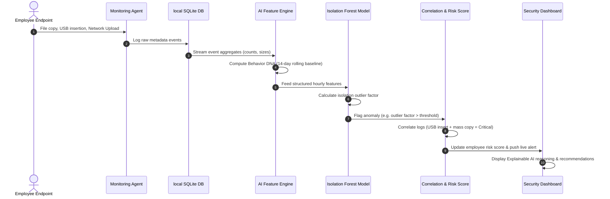

# ThreatVista - Threat Detection Workflow

This document explains the sequential workflow of ThreatVista's telemetry extraction, risk determination, and explainable alerting process.

## Step-by-Step Workflow Details

### 1. Telemetry Capture (Step 1-2)
The Endpoint Monitoring Agent runs as a background service on user workstations. It logs low-level metadata events:
* **File activity**: File creations, moves, renames, and deletions.
* **USB activity**: USB Mass Storage Device insertion events.
* **Network activity**: Outbound bytes uploaded per hour.
* **Process activity**: Terminal executions (`powershell.exe`, `cmd.exe`) and system tool invocations.

These events are immediately written locally to the client's SQLite database to prevent data loss.

### 2. Feature Extraction & Profiling (Step 3-4)
The Feature Engineering module fetches events and compiles them into sliding window statistics:
* Total file modifications per hour.
* Total bytes uploaded outside of working hours.
* Rate of USB insertions.

The system builds the **Behavior DNA** profile, establishing a personalized normal baseline (e.g., *Rahul uploads 15 MB/day on average, works from 9:00 AM to 6:00 PM, and rarely uses USB flash drives*).

### 3. Anomaly Evaluation & Correlation (Step 5-8)
* **Isolation Forest**: The AI model takes the features and isolates outliers. A high Isolation Forest score suggests that the user is exhibiting behavior starkly different from their historical norms.
* **Correlation Engine**: Individual anomalies might just be noise (e.g., a one-off late-night file edit). However, if the correlation engine sees multiple anomalies happening in tandem (e.g., an unusual login time + high-volume file copying + a USB insertion), it escalates the threat severity.
* **Risk Score Generation**: The dynamic Risk Score rises based on correlation confidence.

### 4. Admin Alerting & Explainability (Step 9-10)
When a threshold is breached, an alert is dispatched to the Admin Console. The console provides:
* **Risk Score**: A number between 0 and 100.
* **Telemetry Evidence**: The supporting data (e.g., 1.2 GB uploaded).
* **Explainable AI Explanation**: Direct, readable text (e.g., *Rahul Sharma's risk score is 92 due to mass copying of 120 patent files following a 1.2 GB external upload*).
* **Recommended Mitigation**: Recommended administrator procedures (e.g., *Temporarily revoke USB access, contact Engineering Director, audit recent git commits*).
